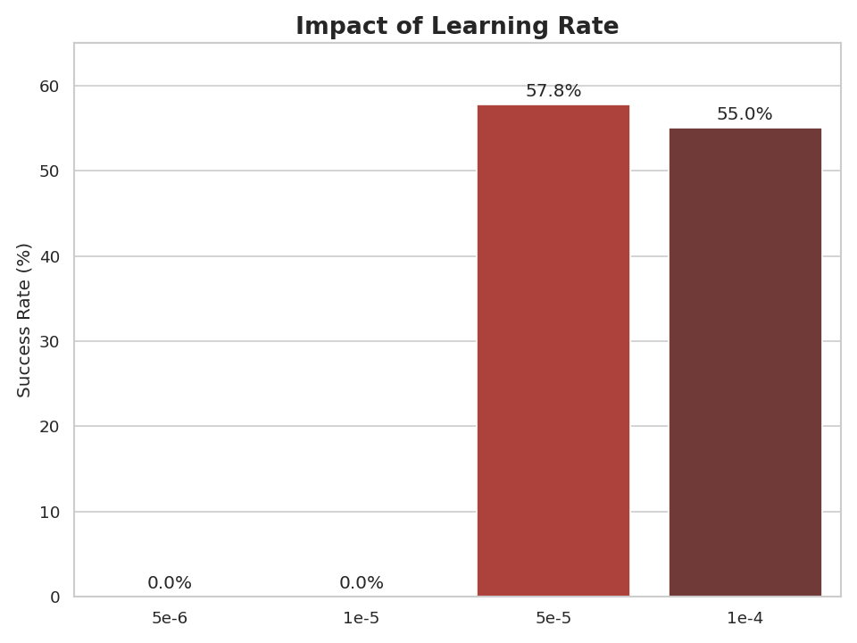
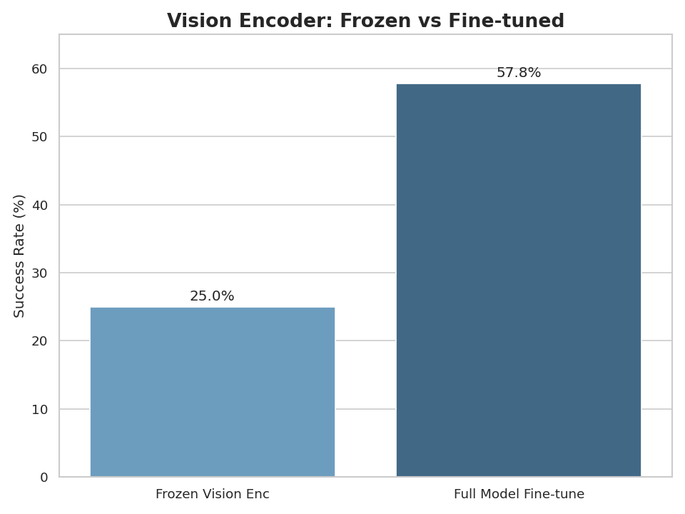
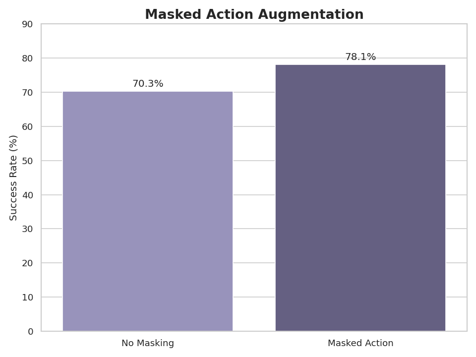

We present a compact VLA model (500M params) that achieves a high score on simulation benchmarks with a clear recipe to reproduce results and a detailed ablation study showing the impact of key design choices.

# Introduction

We really like the [LeRobot](https://huggingface.co/lerobot) project and its community. It lowers the barrier to entry for learning-based robotics in a big way and makes it much easier to start experimenting with real robot learning systems.

But code alone is not enough. You still need to know how to train a model, and this is where many people get stuck. On one side, you have great software tools. On the other, you have research papers that describe new methods and ideas. But turning a paper into a working system is often not straightforward. Many important details are missing because they were not the focus of the paper or because they seem “obvious” to the authors. In practice, you need experience to fill in those gaps and that makes learning robotics much harder than it needs to be.

Another big issue is model size. Most recent vision–language–action (VLA) models are in the 3–7B parameter range. That’s reasonable for big labs, but it’s a lot for the broader community. Training such models usually requires multiple GPUs, distributed setups, and a lot of engineering effort. They are also slow and expensive to run, which makes local inference and real-robot experiments much harder.

This project started with a simple goal:

<div style="
  background: rgba(59,130,246,0.08);
  border-left: 6px solid #3b82f6;
  padding: 16px 20px;
  margin: 24px 0;
  border-radius: 8px;
">
  We want to provide a clear, reproducible path with code, configs, pretrained checkpoints and ablation results, while staying under 1B parameters, so that anyone can collect ~100 demonstrations, use the LeRobot framework, and actually train a working robot policy.
</div>


When we found the [VLA-0](https://arxiv.org/abs/2510.13054) paper, we loved it. It showed that you can get strong robotic performance with only small changes to a standard vision–language model. At the same time, it was also a perfect example of the problem we mentioned above: the idea is simple, the paper is well written, but it assumes you already know how to work with VLMs in practice. It is not always clear what really matters, what can be changed, and what can be ignored.

So we decided to integrate VLA-0 into the LeRobot framework. Our requirement to keep the model under 1B parameters left us with an almost unchallenged choice: [SmolVLM2-500M](https://huggingface.co/HuggingFaceTB/SmolVLM2-500M-Video-Instruct). In that sense, we are following in the steps of the [SmolVLA](https://arxiv.org/abs/2506.01844) work, but with a different set of design choices.

Our first milestone was LIBERO, the most common benchmark for VLA models and the same benchmark used by the VLA-0 authors. In this post, we describe our path to that milestone: the design choices we made, the ablations we ran, and what we learned from them.

Our final model reaches performance close to much larger systems ([π<sub>0.5</sub>](https://arxiv.org/abs/2504.16054), [OpenVLA-OFT](https://arxiv.org/abs/2502.19645)) even though it is about six times smaller. We are happy and a bit proud of that. But there is always a “but”. 

We are aware that LIBERO has limitations. It does not always test true generalization, and it uses much more data than the low-data scenarios we ultimately care about. So we do not see this as the end goal. We see it as a first step: a validated, lightweight starting point that we can now use to explore smaller datasets and real-world robots. 

With that, we now switch from motivation to the technical details.


# Design choices ablation and finding best params for VLA-0

## What We Did
We ran systematic ablations on PushT to isolate what matters for training VLAs. We tested:
- Learning rate sensitivity: `5×10⁻⁶`, `1×10⁻⁵`, `5×10⁻⁵`, `1×10⁻⁴`.
- Vision encoder fine-tuning vs. freezing.
- State/action representations: absolute vs. relative; with/without state tokens.
- System prompts: whether structured prompts help after fine-tuning.

We made two pragmatic choices:
- Use [SmolVLM2](https://huggingface.co/blog/smolvlm2) (sub-billion params) to keep experiments on consumer GPUs.
- Start with [PushT](https://github.com/huggingface/gym-pusht) for faster iteration and clearer signal than full [LIBERO](https://libero-project.github.io/main.html).

# Method

This chapter describes the key design components of [VLA-0](https://arxiv.org/abs/2510.13054) and highlights the specific modifications we introduced in our implementation. Rather than re-deriving the full method, we focus on the architectural choices, input representations, training augmentations, and system-level considerations that are most relevant for understanding how our setup differs from the original approach. These design decisions provide the context needed to interpret the ablation results and performance analyses presented in the following sections.

## Model Architecture
The [VLA-0](https://arxiv.org/abs/2510.13054) authors use [Qwen-VL-2.5-3B](https://huggingface.co/Qwen/Qwen2.5-VL-3B-Instruct) as the vision–language backbone. In contrast, we chose a smaller model to enable inference on a laptop equipped with a consumer-grade GPU, with the goal of eventually evaluating the system on a real robot. For this reason, we focused on sub-billion-parameter models and selected [SmolVLM2-500M](https://huggingface.co/HuggingFaceTB/SmolVLM2-500M-Video-Instruct). This model comes with solid documentation and has been trained on tasks that require spatial understanding; it has also been evaluated for robotic applications in the SmolVLA work.

We use the standard SmolVLM2 implementation from the Transformers library with one key modification. In the original setup, the authors employ an image tiling strategy in which both the original image and an upscaled version split into 16 tiles are passed to the image encoder. While effective, this approach significantly increases computational cost and is impractical for real-time robotic applications. Instead, we pass only the original image to the image encoder. This simplification matches the approach used in SmolVLA and makes the model more suitable for deployment on resource-constrained robotic systems.

### Model Input
We largely follow the approach of the original paper, with minor modifications to accommodate the [SmolVLM2](https://huggingface.co/blog/smolvlm2) chat template.

Specifically, we construct a chat-style prompt that includes the image observation along with task description, explicit state and action tokens.

When used, the state is discretized into N bins and appended to the input as a sequence of integer tokens represented in text form. Similarly, a chunk of actions is discretized into M bins, flattened into a time-ordered sequence, and provided to the model also as text.

<div style="font-family: 'SF Mono', Menlo, Monaco, Consolas, 'Liberation Mono', 'Courier New', monospace; background: #ffffff; padding: 24px; border-radius: 12px; border: 1px solid #e2e8f0; overflow-x: auto; line-height: 2.4; box-shadow: 0 4px 6px -1px rgba(0, 0, 0, 0.05);">
  <div style="margin-bottom: 12px; border-left: 4px solid #94a3b8; padding-left: 12px;">
    <span style="background: #f1f5f9; color: #475569; padding: 4px 8px; border-radius: 4px; #93c5fd; font-size: 0.9em; margin-right: 4px;">&lt;|im_start|&gt;User:</span>
    <span style="background: #eff6ff; color: #1e40af; padding: 4px 8px; border-radius: 4px; border: 1px solid #bfdbfe; font-size: 0.9em; margin-right: 4px;">&lt;fake_token_around_image&gt;&lt;global-img&gt;</span>
    <span style="background: #dbeafe; color: #1e40af; padding: 4px 8px; border-radius: 4px; border: 1px solid #93c5fd; font-size: 0.9em; margin-right: 4px;">
    <svg xmlns="http://www.w3.org/2000/svg" width="10" height="10" viewBox="0 0 24 24" fill="none" stroke="currentColor" stroke-width="2" style="vertical-align: middle; margin-right: 2px;"><rect x="3" y="3" width="18" height="18" rx="2" ry="2"></rect><circle cx="8.5" cy="8.5" r="1.5"></circle><polyline points="21 15 16 10 5 21"></polyline></svg> [Image Embeddings (64 patches)]</span> <span style="background: #eff6ff; color: #1e40af; padding: 4px 8px; border-radius: 4px; border: 1px solid #bfdbfe; font-size: 0.9em; margin-right: 8px;">&lt;fake_token_around_image&gt;</span>
    <span style="background: #f0fdf4; color: #166534; padding: 4px 8px; border-radius: 4px; border: 1px solid #bbf7d0; font-size: 0.9em; margin-right: 4px;">Task: Description of the task to be performed,</span>
    <span style="background: #fff7ed; color: #9a3412; padding: 4px 8px; border-radius: 4px; border: 1px solid #ffedd5; font-size: 0.9em; margin-right: 4px;">State: 341 182,</span>
    <span style="background: #fff1f2; color: #be123c; padding: 4px 8px; border-radius: 4px; border: 1px solid #fecdd3; font-size: 0.9em; margin-right: 4px; font-size: 0.9em;">Actions:</span>
    <span style="background: #f1f5f9; color: #475569; padding: 4px 8px; border-radius: 4px; font-size: 0.9em;">&lt;end_of_utterance&gt;</span>
  </div>
  <div style="border-left: 4px solid #818cf8; padding-left: 12px;">
    <span style="background: #eef2ff; color: #3730a3; padding: 4px 8px; border-radius: 4px; margin-right: 8px; font-size: 0.9em; ">Assistant:</span>
    <span style="background: #f5f3ff; color: #5b21b6; padding: 4px 8px; border-radius: 4px; border: 1px solid #ddd6fe; font-size: 0.9em;">227 232 223 191</span> <span style="background: #f1f5f9; color: #475569; padding: 4px 8px; border-radius: 4px; font-size: 0.9em; margin-left: 6px;">&lt;end_of_utterance&gt; &lt;|im_end|&gt;</span>
  </div>
</div>
<p style="text-align: center; font-size: 0.9rem; color: #667; margin-top: 10px;"><em>Figure 1: The multimodal input sequence formatted for the SmolVLM2 chat template.</em></p>

The original authors use a system prompt to describe the task and guide the model’s behaviour. Since it was unclear how critical this component is, we ablated it by evaluating the model both with and without the system prompt.

### Masked Action Augmentation

As part of our training pipeline, we use masked action augmentation, a data augmentation technique in which random characters in the target action string are masked during training.

Previous work on [VLA-0](https://arxiv.org/abs/2510.13054) demonstrated that action masking significantly improves success rates on the [LIBERO](https://libero-project.github.io/main.html) benchmark. We adopted this technique with a modification: instead of masking individual characters, we mask the entire action value. This augmentation aims to mitigate the model's reliance on auto-completing numerical sequences, thereby enforcing stronger dependence on visual observations. We hypothesized that character-level masking might still allow for implicit completion; whole-action masking eliminates this possibility.

| Strategy | Masking level | Original Action | Training Input |
| :--- | :--- | :--- | :--- |
| **VLA-0** | Character | `425 180 090` | `4[MASK]5 18[MASK] 090` |
| **VLA-0-Smol** | Action | `425 180 090` | `[MASK] 180 [MASK]` |

### Grammar Enforcing

Although the model generally converges on the correct output format, the limited size of usual robotics datasets can occasionally cause the policy to generate an incorrect number of tokens, leading to trajectory failure. To mitigate this, we implemented grammar constraints that strictly enforce the output format and sequence length, preventing the generation of invalid tokens.

### Performance

We discovered that our model is primarily CPU-bound. This means the overhead of placing a CUDA kernel call takes more time than the actual execution on the GPU. Model compilation is typically the best solution for this; however, we encountered compatibility issues when using it within the LeRobot framework alongside the Accelerate library. 


<p style="text-align: center; font-size: 0.9rem; color: #667; margin-top: 10px;"><em>Model's execution trace on the GPU.</em></p>

- **Mixed Precision:** We found that training in `float16` leads to gradient explosions. Switching to `bfloat16` completely resolved this issue.
- **Loss Calculation:** Calculating loss in mixed precision resulted in slight performance degradation. To fix this, we convert our logits to full precision before computing the loss. This approach provides nearly the same accuracy as full-precision training but is almost twice as fast.
- **FlashAttention:** We chose not to use FlashAttention as it provides no performance boost. This is due to our relatively small sequence lengths (usually under 512 tokens), where standard attention implementation is already highly efficient.

Having outlined the core components of [VLA-0](https://arxiv.org/abs/2510.13054) and the modifications introduced in our implementation, we now turn to a systematic evaluation of these design choices. In the next chapter, we use controlled ablation studies to quantify how individual decisions — such as optimization settings and model freezing — affect performance. These experiments provide empirical grounding for the design choices discussed above and clarify which components are most critical for successful learning.

## Ablations

<div style="display:flex; flex-wrap:wrap; gap:1rem; align-items:flex-start;">
  <div style="flex:1 1 320px; min-width:280px; max-width:640px;" markdown="1">
For ablations, we used the PushT task. The task is performed in a 2D space, making it simpler than 3D manipulation while still requiring the agent to learn accurate pushing motions. The agent observes the scene through RGB images and controls a 2D end-effector position. Success is measured by whether the T-block’s final pose matches the target within a specified tolerance.
  </div>
  <div style="flex:1 1 320px; min-width:280px; max-width:480px; text-align:center;">
    
    <p style="font-size: 0.9rem; color: #667; margin-top: 8px;"><em>Example of a successful demonstration</em></p>
  </div>
</div>

We evaluate all models purely on success rate: the percentage of episodes where the T-block reaches the target pose within tolerance. Each evaluation runs 64 episodes and we report the success rate at the best checkpoint unless otherwise specified.

For completeness and reproducibility, we provide the full set of hyperparameters and training details for every experiment in our public Weights & Biases [workspace](https://wandb.ai/sergeyskv/rlc_public?nw=nwusersergeyskv).

### Learning Rate

Learning rate is often treated as a hyperparameter to tune, but its importance for VLA fine-tuning was unclear. We tested four learning rates `5×10⁻⁶`, `1×10⁻⁵`, `5×10⁻⁵`, and `1×10⁻⁴`, keeping all other parameters constant (relative actions, no state, full model training).

The results show that learning rate has a dramatic impact on performance. The two smallest learning rates (`5×10⁻⁶` and `1×10⁻⁵`) completely failed to learn, achieving 0% success rate throughout training. This suggests that VLA-0's choice of `5×10⁻⁶` may have worked for their 100,000 training steps but is too conservative for our 30,000 step training regime.

At `5×10⁻⁵`, we observed the best performance with a final success rate of 57.8%. The highest learning rate (`1×10⁻⁴`) showed slightly worse performance, suggesting we may be approaching the upper bound of stable learning rates for this task.

<div style="text-align: center;">
  
</div>
<p style="text-align: center; font-size: 0.9rem; color: #667; margin-top: 10px;"><em>Impact of learning rate on the success rate in the PushT task.</em></p>

### Vision Encoder Freezing

A common question in fine-tuning large models is whether you can get away with freezing some components. For VLMs, the vision encoder is an obvious candidate — it's large, and freezing it would speed up training and reduce memory usage. However, vision encoders in VLMs are typically trained on natural images, not robotics scenes, so it's unclear if their frozen features are sufficient for manipulation tasks.

We compared training the full model (vision encoder + connector + language model) against freezing the vision encoder and only training the connector and language model.

**Freezing the vision encoder drops success rate from 57.8% to 25%** — a 32 percentage point decrease. This suggests that the features learned by pre-trained vision encoders on natural images are not directly suitable for robotic manipulation, and the model benefits significantly from adapting the visual representations during fine-tuning.

This result is somewhat disappointing from a practical standpoint. We had hoped that frozen vision encoders would be sufficient, which would make training faster and potentially preserve performance on other vision-language tasks. However, the data clearly shows that vision encoder fine-tuning is necessary for good performance on manipulation tasks.

<div style="text-align: center;">
  
</div>
<p style="text-align: center; font-size: 0.9rem; color: #667; margin-top: 10px;"><em>Impact of freezing vision encoder on the success rate in the PushT task.</em></p>

### State and Action Representations

The robotics literature shows considerable variation in how actions and states are represented. We tested four combinations to understand their individual and combined effects:


| Configuration	| State	| Actions	| Success Rate |
| :--- | :--- | :--- | :--- |
| Baseline	| No	| Absolute	| 29.7% |
| + Relative actions	| No	| Relative	| 57.8% |
| + State	| Yes	| Absolute	| 45.3% |
| Full	| Yes	| Relative |	70.3% |


The results show clear trends:

- **Relative vs. Absolute Actions**: Switching from absolute to relative actions provided the largest single improvement. This aligns with common practice in robot learning — relative actions are often easier to learn because they're invariant to the absolute position in the workspace and typically have smaller magnitudes.
- **Adding State Information**: Including the discretized state vector in the prompt also improved performance, though the effect was less dramatic than the action representation choice. This is somewhat surprising — we expected the model might be able to infer the relevant state information from the image alone. The improvement suggests that explicit state information helps the model, even when that information should theoretically be extractable from visual observations.
- **Combined Effect**: The best performance came from using both relative actions and state information, suggesting these design choices are complementary rather than redundant.

### System Prompt

VLA-0 uses a structured system prompt that explicitly describes the output format. We tested whether this prompt provides any benefit after fine-tuning, since one might expect that during fine-tuning, the model learns the desired output format from the data itself.

We compared training with and without the system prompt, keeping all other parameters constant. **The results show no difference in performance** — both conditions achieved the same success rate. This suggests that after fine-tuning on task-specific data, the system prompt becomes redundant. The model learns the output format from the training examples themselves.

### Masked Action Augmentation

Adding action masking improved the success rate from **70.3% to 78.1%**. This significant jump validates the hypothesis we set out to test: that preventing the model from relying on character-level auto-completion results in a stronger policy. It also confirms that the benefits of action masking, originally reported by the VLA-0 authors, transfer effectively to the smaller SmolVLM2 architecture and our specific whole-action masking strategy.

<div style="text-align: center;">
  
</div>
<p style="text-align: center; font-size: 0.9rem; color: #667; margin-top: 10px;"><em>Impact of masking actions on the success rate in the PushT task.</em></p>

### Ensemble Prediction

VLA-0 employs temporal ensembling across N tokens to smooth out action sequences. For the PushT task, we experimented with a standard n-tokens ahead approach, where we predicted and executed a fixed chunk of `N=5` tokens.

When comparing these two methods, we found that temporal ensembling yielded no significant performance boost for PushT. Therefore, to optimize computational efficiency and inference speed, we opted for the 5-tokens ahead approach.

### What We Learned

Our ablation study on PushT reveals a clear hierarchy of importance for VLA training decisions:

**Critical choices** (large impact on performance):

- **Learning rate**: Getting this wrong means complete failure (0% success) or suboptimal performance. For 30,000 training steps, `5×10⁻⁵` worked best, but this likely needs adjustment for different training budgets.
- **Vision encoder fine-tuning**: Freezing the vision encoder cuts performance by more than half. Pre-trained visual features from natural images aren't sufficient for manipulation tasks.
- **Masked Action Augmentation:** This proved to be a major performance driver, boosting success rates from 57.8% to 78.1%. Preventing the model from relying on numerical pattern matching significantly improves policy robustness.
- **Action representation**: Relative actions substantially outperform absolute actions, consistent with broader robotics literature.

**Helpful but secondary**:

- **State information**: Provides a meaningful boost, even though the information should be present in the images. The explicit state signal seems to help the model learn faster or more reliably.

**Doesn't matter**:

- **System prompts**: After fine-tuning, the model learns output formats from data. Carefully crafted prompts add no value during training.
- **Temporal Ensembling:** Temporal ensembling did not improve performance on PushT, suggesting it is unnecessary for short-horizon, planar manipulation tasks.

## LIBERO

<div style="display:flex; flex-wrap:wrap; gap:1rem; align-items:flex-start;">
  <div style="flex:1 1 320px; min-width:280px; max-width:640px;" markdown="1">
Having identified the most impactful design choices on PushT, we next ask whether these conclusions transfer to a substantially more challenging setting. While PushT enables rapid iteration, it lacks the visual complexity, long-horizon structure, and embodiment constraints of real-world manipulation. To test the robustness of our findings, we applied the best-performing configuration from our ablation study directly to LIBERO, a standard benchmark for evaluating vision–language–action models in 3D environments.
  </div>
  <div style="flex:1 1 320px; min-width:280px; max-width:480px; text-align:center;">
    
    <p style="font-size: 0.9rem; color: #667; margin-top: 8px;"><em>Example of a successful demonstration of a tabletop robot arm performing a pick-and-place task</em></p>
  </div>
</div>


[**LIBERO**](https://libero-project.github.io/main.html) is a 3D robotic manipulation suite designed to evaluate how agents transfer and retain skills across a diverse range of tasks. In this environment, an agent operates a 7-DOF robotic arm within kitchen or tabletop settings, observing the scene via RGB images from both a workspace camera and a wrist-mounted camera.

Success is measured by the agent's ability to complete long-horizon tasks and maintain its performance on previously learned tasks after acquiring new ones. Following the VLA-0 paper, we compared our model across four specific task suites:

- **Object:** Tests generalizable object recognition by varying the types of objects manipulated (e.g., "pick up the `ketchup/milk/juice` and put it in the basket").
- **Spatial:** Focuses on spatial relationships and layouts (e.g., "put the bowl on the plate" with varying initial object positions).
- **Goal:** Maintains the same object set but varies the end goal (e.g., "open the drawer" vs. "put the mug in the drawer").
- **Long:** Emphasizes long-horizon, procedural sequences (e.g., "open the microwave and put the bowl in it"). This requires the agent to chain multiple behaviors together to complete complex, multi-step goals.


### Training Setup

Our LIBERO experiments largely follow the configuration identified as optimal on PushT. We used the same learning rate, enabled action masking, and applied image cropping. The model was trained for **100,000 steps** (approximately 70 epochs) with a **batch size of 192**, using mixed-precision training in **bf16**.

One notable deviation concerns **action representation**. Although relative actions provided a significant performance boost on PushT, we found them difficult to apply reliably to LIBERO due to differences in input structure and task dynamics. As a result, all LIBERO experiments were conducted using absolute actions.

### Results

We evaluated the final model using two inference-time protocols. Following VLA-0, we ensemble predictions across **8 future action tokens**. For comparison, we also report results using a standard **n-tokens-ahead prediction** with n=8, matching the evaluation setup used in our PushT ablations.

Without ensembling, the average success rate on LIBERO drops to **90.7%**, a **3.4 percentage point decrease** relative to the ensembled evaluation. This differs from our PushT results, where temporal ensembling had no measurable impact on performance.

These results indicate that while temporal ensembling is unnecessary for PushT, it provides a clear benefit on LIBERO. In contrast, other high-impact design choices identified on PushT — such as learning rate, vision encoder fine-tuning, and action masking — transfer cleanly to the LIBERO setting.

| Model | Params | Object | Spatial | Goal | Long | Avg |
| :--- | :--- | :--- | :--- | :--- | :--- | :--- |
| Diffusion Policy | 0.15B | 78.3 | 92.5 | 68.3 | 50.5 | 72.4 |
| pi0-FAST | 3B | 87.0 | 63.0 | 89.0 | 48.0 | 71.8 |
| SmolVLA | 0.25B | 87.0 | 93.0 | 88.0 | 63.0 | 82.8 |
| SmolVLA | 2.25B | 93.0 | 94.0 | 91.0 | 77.0 | 88.8 |
| OpenVLA-OFT | 7B | 94.3 | 95.2 | 91.7 | 86.5 | 91.9 |
| pi0.5 - KI | 3.3B | 96.6 | 97.2 | 94.6 | 85.8 | 93.3 |
| VLA-0 | 3B | 97.0 | **97.8** | **96.2** | 87.6 | **94.7** |
| VLA-0-Smol (Ours)| 0.5B | **97.2** | 92.2 | 95.6 | **91.2** | 94.1 |

<small>Source: [Goyal et al. (2025)](https://arxiv.org/abs/2510.13054)</small>

### Analysis

A central question of this work is whether conclusions drawn from fast ablation on PushT transfer to a more complex benchmark. We find that most high-impact design choices identified on PushT generalize well to LIBERO. In particular, the learning rate, vision encoder fine-tuning, and masked action augmentation all remained necessary for strong performance when scaled to 3D, long-horizon tasks.
However, not all conclusions transferred directly. Temporal ensembling, which had no measurable effect on PushT, provided a clear improvement during LIBERO evaluation. This indicates that while PushT is effective for identifying many critical training decisions, it does not fully capture the requirements of long-horizon task execution.

Our analysis of the LIBERO results highlighted two primary areas of interest:

- **Overfitting.** During evaluation, we observed that the model performs near-perfectly on some tasks while failing on others that are visually and logically similar. This suggests that the model may be overfitting to specific task trajectories rather than learning fully generalizable behaviors.

<div style="display: flex; gap: 12px; flex-wrap: wrap; align-items: flex-start;">
  <figure style="flex: 1 1 320px; margin: 0;">
    <video controls playsinline muted loop style="width: 100%; height: auto;">
      <source src="/assets/vla-0-smol/eval_episode_0.mp4" type="video/mp4" />
      Your browser does not support the video tag.
    </video>
  </figure>
  <figure style="flex: 1 1 320px; margin: 0;">
    <video controls playsinline muted loop style="width: 100%; height: auto;">
      <source src="/assets/vla-0-smol/eval_episode_9.mp4" type="video/mp4" />
      Your browser does not support the video tag.
    </video>
  </figure>
</div>

- **Model size.** Our 0.5B parameter model achieved performance close to the 3B parameter model used in the original VLA-0 work. This result suggests that, for LIBERO, careful design and training choices can compensate for reduced model capacity. While larger models are typically expected to generalize better, our findings indicate diminishing returns from scale alone under this evaluation setup. We discuss broader implications of this observation in the Discussion section.

## Conclusion
The development of `VLA-0-Smol` demonstrates that massive scale is not the only path to high-performance robotic policies. By distilling the design principles of the VLA-0 architecture into a sub-billion parameter footprint, we have shown that a 500M parameter model can achieve results on par with models six times its size on established benchmarks like LIBERO.

Our systematic ablations highlight a clear hierarchy of importance for training VLAs: fine-tuning the vision encoder, adopting relative action representations, and implementing whole-action masking are not just optimizations — they are fundamental to achieving policy robustness. Conversely, we found that complex system prompts and heavy temporal ensembling often provide diminishing returns in simpler or task-specific domains.

Perhaps most importantly, `VLA-0-Smol` serves as a reproducible recipe for the community. By lowering the hardware barrier to consumer-grade GPUs, we hope to enable more researchers to experiment with Vision-Language-Action models without the need for massive industrial compute clusters.

## Discussions

### **Future Steps**

While VLA-0-Smol is a meaningful step toward more accessible robotics research, it is only a first step. Our main goal is still the same: to create a clear and practical path, with code, configs, pretrained checkpoints (under 1B parameters), and ablation results, that allows anyone to train a robotics model from around 100 demonstrations using the LeRobot framework.

There are two main directions we want to focus on next.

**Real-World Deployment.**

Our primary focus is moving beyond simulation and onto real hardware, specifically the SO100 ARM platform. We want to understand how much of the “memorization” we observed in simulation transfers to the real world, where observations are noisy, lighting changes, and physical interactions are far less predictable. 

**Data Efficiency.**

One of the promises of VLA-style approaches is that they should work well with very limited data. In this work, however, we trained on the full LIBERO dataset with 1693 demonstrations. We do not yet know whether it is possible to achieve reasonable performance with only ~100 demonstrations, which is the regime we ultimately care about. A key goal of our future work is to systematically study how performance scales with data and to identify what the true minimum data requirement is for useful learning.

### **Performance**

Although we significantly reduced model size, inference is still relatively slow due to the autoregressive nature of the model. This currently prevents real-time operation on many consumer devices and mid-range GPUs. One of our practical goals is therefore to optimize the model for real-time inference on user-grade hardware, including platforms like the SO100 ARM robot.

We believe that a large part of this can be addressed through [speculative decoding](https://arxiv.org/abs/2401.15077). Since action sequences are short, structured, and memory-bound, they are good candidates for prediction by smaller draft models. Using speculative decoding could substantially reduce latency without sacrificing output quality, making real-time control more feasible on affordable hardware.

### LIBERO

Recent research from [LIBERO-Plus](https://arxiv.org/abs/2510.13626) and [LIBERO-PRO](https://arxiv.org/abs/2510.03827) confirms what we suspected: high scores on LIBERO don't always mean the model is "smart". These papers found that many models, even huge ones, are often just memorizing the training data instead of truly understanding the task. When researchers made small changes — like moving objects slightly, changing the lighting, or even messing up the text instructions — the models often failed completely. In some cases, the models ignored the language instructions entirely and just repeated the exact same movement they learned during training.

This explains why our tiny 0.5B model was able to perform just as well as the big 3B model. It seems the standard LIBERO benchmark is mostly testing memory, not skill. Since even small models can memorize things well, the difference in model size didn't matter as much as we expected. We know this means our high scores might not fully prove our model is ready for the real world just yet. To fix this, we want to move beyond simulation and start experimenting on a real robot, where the "messiness" of the real world will act as the ultimate test of our model's true skills

# Acknowledgments
<a href="https://nebius.com/" target="_blank">
  
</a>

We would like to thank [Nebius](https://nebius.com) for providing the GPU resources that made this research possible. Their support was instrumental in training `VLA-0-Smol` and conducting the extensive evaluations across the [LIBERO](https://libero-project.github.io/main.html) and PushT benchmarks.

# Team

<style>
.team-grid { display: flex; justify-content: center; gap: 3rem; flex-wrap: wrap; margin: 2rem 0; }
.team-member { text-align: center; }
.team-member img { width: 120px; height: 120px; border-radius: 50%; object-fit: cover; border: 3px solid #ddd; }
.team-member p { margin-top: 0.75rem; font-weight: 500; color: #333; }
</style>

<div class="team-grid">
  <div class="team-member">
    
    <p><a href="https://www.linkedin.com/in/oleg-balakhnov-a591a1233/">Oleg Balakhnov</a></p>
  </div>
  <div class="team-member">
    
    <p><a href="https://www.linkedin.com/in/sergei-skvortsov/">Sergei Skvortsov</a></p>
  </div>
  <div class="team-member">
    
    <p><a href="https://www.linkedin.com/in/zaringleb/">Gleb Zarin</a></p>
  </div>
</div>

# References
1. Shukor, M., Aubakirova, D., Capuano, F., Kooijmans, P., Palma, S., Zouitine, A., ... & Cadene, R. SmolVLA: A Vision-Language-Action Model for Affordable and Efficient Robotics. arXiv preprint arXiv:2506.01844 (2025).
   
2. Zhao, T. Z., Kumar, V., Levine, S., & Finn, C. "Learning Fine-Grained Bimanual Manipulation with Low-Cost Hardware." arXiv preprint arXiv:2304.13705 (2023).
  
3. Ankit Goyal, Hugo Hadfield, Xuning Yang, Valts Blukis, and Fabio Ramos. "VLA-0: Building State-of-the-Art VLAs with Zero Modification." arXiv preprint arXiv:2510.13054 (2025).

4. Bo Liu, Yifeng Zhu, Chongkai Gao, Yihao Feng, Qiang Liu, Yuke Zhu, and Peter Stone. "LIBERO: Benchmarking Knowledge Transfer for Lifelong Robot Learning." arXiv preprint arXiv:2306.03310 (2023).

5. Andrés Marafioti et al. "SmolVLM: Redefining small and efficient multimodal models." arXiv preprint arXiv:2504.05299 (2025).

6. Shuai Bai et al. "Qwen2.5-VL Technical Report." arXiv preprint arXiv:2502.13923 (2025).

7. Senyu Fei et al. "LIBERO-Plus: In-depth Robustness Analysis of Vision-Language-Action Models." arXiv preprint arXiv:2510.13626 (2025).

8. Xueyang Zhou et al. "LIBERO-PRO: Towards Robust and Fair Evaluation of Vision-Language-Action Models Beyond Memorization." arXiv preprint arXiv:2510.03827 (2025).

9.  Cheng Chi et al. "Diffusion Policy: Visuomotor Policy Learning via Action Diffusion." arXiv preprint arXiv:2303.04137 (2023).

10. TheRobotStudio. (2024). SO-ARM100 [GitHub Repository]. GitHub. Available at: https://github.com/TheRobotStudio/SO-ARM100

11. TRI LBM Team et al. “A Careful Examination of Large Behavior Models for Multitask Dexterous Manipulation” arXiv preprint arXiv:2507.05331 (2025).

12. Yuhui Li et al. "EAGLE: Speculative Sampling Requires Rethinking Feature Uncertainty" arXiv preprint arXiv:2401.15077  (2024).

13. Physical Intelligence et al. “π<sub>0.5</sub>: a Vision-Language-Action Model with Open-World Generalization” arXiv preprint arXiv:2504.16054

14. Moo Jin Kim et al. "Fine-Tuning Vision-Language-Action Models: Optimizing Speed and Success" arXiv preprint arXiv:2502.19645v2 (2025).

# Citation 

Please cite as:

```txt
Balakhnov et al., "VLA-0-Smol: A Reproducible Recipe for High-Performance, Sub-Billion Parameter VLAs", Robot Learning Collective blog, 2025.
```

BibTeX citation:
```txt
@article{balakhnov2025vla0smol,
  title={VLA-0-Smol: A Reproducible Recipe for High-Performance, Sub-Billion Parameter VLAs},
  author={Balakhnov, Oleg and Skvortsov, Sergei and Zarin, Gleb},
  year={2025},
  journal={Robot Learning Collective blog},
  note={}
}
```