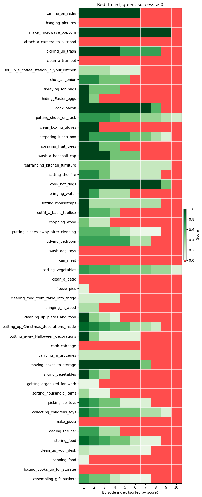

We present a vision-action policy that achieved first place in the 2025 BEHAVIOR Challenge, a large-scale benchmark of 50 long-horizon household tasks in photo-realistic simulation requiring bimanual manipulation, navigation, and object interaction.
Building on the Pi0.5 architecture, we introduce several innovations, including **correlated noise for flow matching** to improve training efficiency and produce smoother action sequences, as well as **learnable mixed layer attention** and **System 2 stage tracking** for ambiguity resolution. Training uses **multi-sample flow matching** to reduce variance, while inference applies action compression and heuristics to overcome dataset limitations. 
Our method achieves a 26% q-score on both public and private leaderboards, and this report provides a detailed **analysis of observed failure modes**.

## Challenge

  <h3 id="task-examples" style="margin-top: 0;">Training Examples</h3>
  
<em>Each task comes with 200 demonstrations recorded via teleoperation. Video: robot head camera 8× speed.</em>

  

    

    

  

The Challenge includes 50 tasks set in multiple house-like environments. The main difficulties are:
* **Long-horizon execution:** Tasks run for an average of 6.6 minutes.
* **Bimanual manipulation:** Coordinated control of two 7-DOF arms with parallel jaw grippers.
* **Mobile navigation:** Operation in realistic indoor and outdoor environments.
* **Non-Markovian states:** Many states are visually ambiguous. Without memory of past actions or explicit stage tracking, the policy cannot distinguish between these states and may take incorrect actions.
* **No recovery demonstrations:** The training set contains only successful demonstrations, spanning a very narrow manifold of possible trajectories.
* **Data:** Each task provides 200 demonstrations. Public evaluation uses 10 additional instances; the private leaderboard evaluates performance on a separate held-out set of another 10 instances.
* **High compute requirements:** Training on all 1200 hours of data takes weeks, and full evaluation across all tasks takes several days.

## Model

  

    <button id="prev-step" style="width: 16.66%; min-width: 60px; cursor: pointer; border: none; border-right: 1px solid #e5e7eb; background: white; font-weight: bold; font-size: 2.5rem; line-height: 1; display: flex; align-items: center; justify-content: center; flex-shrink: 0;">&larr;</button>
    

      <h4 id="step-title" style="margin: 0 0 0.5rem 0; color: #1e293b; font-size: 1.1rem;">VLA Foundation</h4>
      
Our policy is based on the Pi0.5 vision-language-action (VLA) architecture, combining a SigLIP vision encoder with a Gemma LLM backbone.

    

    <button id="next-step" style="width: 16.66%; min-width: 60px; cursor: pointer; border: none; border-left: 1px solid #e5e7eb; background: white; font-weight: bold; font-size: 2.5rem; line-height: 1; display: flex; align-items: center; justify-content: center; flex-shrink: 0;">&rarr;</button>
  

  

    
Loading interactive model...

  

  
  

## Results

On the held-out evaluation, our approach achieves **q-score ~0.26** (including partial successes) with minimal public–private gap.

| Rank | Team | Affiliation | Task Success (private) | Q-Score (private) |
|:----:|:-----|:------------|:----------------------:|:-----------------:|
| **1** | **Robot Learning Collective (ours)** | Independent | 0.124 | **0.260** |
| 2 | Comet | NVIDIA Research | 0.114 | 0.251 |
| 3 | SimpleAI Robot | Beijing Simple AI Technology | 0.108 | 0.159 |
| 4 | The North Star | Huawei CRI EAI Team | 0.076 | 0.120 |
| 5 | Embodied Intelligence | Independent | 0.052 | 0.095 |

Top 5 teams on the held-out test set ([leaderboard](https://behavior.stanford.edu/challenge/leaderboard.html))

### Per individual task results

  

    <ul>
      <li>Average task success rate varies significantly. Some tasks are almost solved, except under particularly tricky initial conditions, while in others, the model was unsuccessful across all 10 trials.</li>
      <li>For tasks with 0 success, we do not observe that they are generally impossible; instead, they usually contain one tricky step that involves very high-precision manipulation (with low success rate even for human teleoperators) or a carefully followed sequence that is slightly beyond the current model's limits.</li>
      <li>Task duration does not appear to be a fundamental obstacle: longer tasks simply have many more steps, which makes full success harder, but partial success remains very achievable.</li>
    </ul>
  

  

    

      
    

    <small style="display: block; color: #666; margin-top: 0.5rem;">Per-task and per-episode scores sorted by task duration. Green = success; light green = partial success; red = failure. <em>Click to enlarge.</em></small>
  

  

    
    

  

  <h3>Examples of 100% Successful Episodes</h3>
  
Select an episode to show 10X-speed clip

  

    

    

  

### Failure Analysis

To analyze why the robot fails, we labeled failures on a subset of tasks (15/50). *Select a reason to see the explanation and video examples:*

  <em>Select a reason to see the explanation and video examples.</em>

  <h3>Examples of Failure Episodes</h3>
  
Select an episode to show 5X-speed clip

  

    

    

  

Please note that fail reason labeling is subjective, and is there to provide a big picture. Refer to all evaluation videos and scores [here](https://drive.google.com/drive/folders/12Wb21mQi6UP8_OMKPGNHOII_-MV3oxk-?usp=sharing).

### Recovery from cross-task learning

Training on all 50 tasks leads to **emergent behaviors**. Due to the data collection process, single-task models never recover from mistakes; the multi-task model trained sufficiently long learns to use skills from other tasks to recover (e.g., to pick up a dropped item).

  <button class="active" onclick="showRecovery(0)">Example 1</button>
  <button onclick="showRecovery(1)">Example 2</button>

  

    

      <video autoplay muted playsinline controls data-src="https://pub-a5638afed52c4226aac6a1e71ecc323c.r2.dev/behavior_report/recovery_picture_early_ex1.mp4"></video>
      
Single task model: no attempt to recover

    

    

      <video muted playsinline controls data-src="https://pub-a5638afed52c4226aac6a1e71ecc323c.r2.dev/behavior_report/recovery_picture_late_ex1.mp4"></video>
      
Multi task model: non-trivial recovery

    

  

  

    

      <video autoplay muted playsinline controls data-src="https://pub-a5638afed52c4226aac6a1e71ecc323c.r2.dev/behavior_report/recovery_picture_early_ex2.mp4"></video>
      
Single task model: no attempt to recover

    

    

      <video muted playsinline controls data-src="https://pub-a5638afed52c4226aac6a1e71ecc323c.r2.dev/behavior_report/recovery_picture_late_ex2.mp4"></video>
      
Multi task model: non-trivial recovery

    

  

## Summary

* The dominant failure modes closely reflect real-world challenges faced by imitation-learning-based robotics models, supporting the role of the BEHAVIOR benchmark as a valuable test bed for evaluating new approaches.
* Evidence from cross-task learning reinforces the view that imitation-learning-based models benefit significantly from training on diverse datasets.
* Due to limited resources for thorough ablation studies, we cannot precisely identify which components were critical. Nonetheless, the combined approach proves robust and outperforms comparable Pi0.5-based methods despite having a smaller training budget.

---

  

    
    
<a href="https://www.linkedin.com/in/larchenko/">Ilia Larchenko</a>

  

  

    
    
<a href="https://www.linkedin.com/in/zaringleb/">Gleb Zarin</a>

  

  

    
    
<a href="https://www.linkedin.com/in/akash-karnatak-9027371a0/">Akash Karnatak</a>

  

### Acknowledgments
This work was made possible by the generous support of [Nebius](https://nebius.com/), who provided the high-performance cloud GPU compute resources required to train our models.

We would also like to thank the following people for their help and
support: [Vladimir Ershov](https://www.linkedin.com/in/vladimir-ershov-33559466/), [Justyna Ilczuk](https://www.linkedin.com/in/justynailczuk/), [Andrey Mulenkov](https://www.linkedin.com/in/andrey-mulenkov/).

Interested in Robot Learning? Join our [Discord](https://discord.gg/Jr8tcnVNGw) to discuss the Challenge results and collaboration.