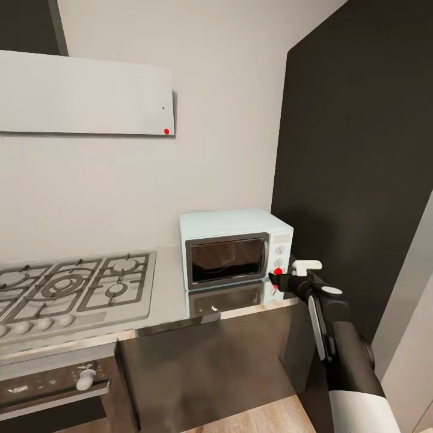

# Intro
The Robot Learning Collective took **1st place** in the 2025 **BEHAVIOR-1K Challenge**, a large-scale benchmark of 50 long-horizon household tasks in photo-realistic simulation. Each episode spans minutes of bimanual manipulation and navigation, with a single policy expected to generalize across diverse activities such as turning on a radio, cooking a hotdog, or tidying a room. This post gives a high-level tour of our solution and what we learned, with full details in the accompanying technical report.

# Behavior-1K Challenge

Our system builds on the **Pi0.5 vision-language(-action) architecture**, but makes several key changes tailored to long-horizon embodied control. The core idea is to treat action sequences as a structured object, not just independent timesteps: we train our flow-matching policy with **correlated noise** drawn from an empirical action covariance matrix. This makes training more sample-efficient and unlocks **correlation-aware inpainting** at inference time, so we can refine or replan parts of a trajectory while preserving smooth, coordinated motion across joints and time.

Long-horizon household tasks are also highly **non-Markovian**: visually similar frames can correspond to very different progress states (for example, holding a radio at the start vs the end of a task). To address this, we add a lightweight **System 2 stage tracker** that predicts discrete task stages, smooths them with a voting mechanism, and feeds the resulting progress signal back into the policy. This helps the model avoid getting stuck in “tails” of demonstrations and mitigates some common order and early-termination errors.

We complement the learned policy with **simple correction rules** derived from failure analysis. These heuristics handle frequent but easy-to-detect problems—such as accidental gripper closures or getting slightly misaligned before a key manipulation step—where a bit of hand-crafted structure can provide robust recovery without extra training data. At inference time we also apply **action compression** via spline interpolation, executing a shorter, smoothed sequence of actions for a **1.3× speedup** without hurting success rate.

On the held-out BEHAVIOR-1K evaluation, our approach achieves a **q-score of ~0.26** with very small public–private gap, outperforming strong industrial and academic baselines. Analysis of per-task performance and labeled failure modes highlights two main bottlenecks going forward: dexterous manipulation robustness and richer, more diverse data to widen the manifold where VLA policies behave sensibly. We see this work as a step toward practical, competition-grade VLA systems that combine strong low-level learning with thin but well-placed System 2 scaffolding.

  <figure style="max-width: 48%; min-width: 260px; margin: 0;">
    
    <figcaption style="font-size: 0.9rem; text-align: center; margin-top: 0.25rem;">
      Grasping the microwave door handle in the <code>make_microwave_popcorn</code> task.
    </figcaption>
  </figure>
  <figure style="max-width: 48%; min-width: 260px; margin: 0;">
    
    <figcaption style="font-size: 0.9rem; text-align: center; margin-top: 0.25rem;">
      Pressing the start button after placing the popcorn inside.
    </figcaption>
  </figure>

# Eval

*Per-task and per-episode scores across the 50 BEHAVIOR-1K activities. Green indicates non-zero success; red indicates failure.*

## Recovery behaviors from cross-task learning

Training on all 50 BEHAVIOR-1K tasks, rather than on single tasks in isolation, leads to **emergent recovery behaviors**. While early single-task models never recovered from mistakes (for example, dropping an object or slightly missing a grasp), the fully multi-task model learns to pick up fallen items, re-approach targets, and generally “try again” instead of freezing—supporting the hypothesis in the technical report that broad cross-task data widens the manifold where the policy behaves sensibly.

We illustrate this with two before/after pairs of rollouts:

  

    

      <iframe src="https://www.youtube.com/embed/uAjF1_p9kJc" title="Before cross-task training" frameborder="0" allowfullscreen style="position: absolute; top: 0; left: 0; width: 100%; height: 100%;"></iframe>
    

    

      Before extensive multi-task training: the policy fails to recover once it deviates from the demonstration trajectory.
    

  

  

    

      <iframe src="https://www.youtube.com/embed/2Xi3uqARchw" title="After cross-task training" frameborder="0" allowfullscreen style="position: absolute; top: 0; left: 0; width: 100%; height: 100%;"></iframe>
    

    

      After cross-task training: the same scenario shows robust recovery, with the robot re-trying and completing the subtask.
    

  

  

    

      <iframe src="https://www.youtube.com/embed/VSazcAkIEGI" title="Before cross-task training (example 2)" frameborder="0" allowfullscreen style="position: absolute; top: 0; left: 0; width: 100%; height: 100%;"></iframe>
    

    

      Second failure case before multi-task training, where a small error cascades into task failure.
    

  

  

    

      <iframe src="https://www.youtube.com/embed/i6cF_g20njg" title="After cross-task training (example 2)" frameborder="0" allowfullscreen style="position: absolute; top: 0; left: 0; width: 100%; height: 100%;"></iframe>
    

    

      After cross-task training the policy now exhibits meaningful recovery behavior and completes much more of the task.
    

  

# Outro

If you’d like to reproduce or build on our results, you can find the **code** and **checkpoints** here:

- Code: [behavior-1k-solution GitHub repo](https://github.com/IliaLarchenko/behavior-1k-solution)
- Checkpoints: [🤗](https://huggingface.co/IliaLarchenko/behavior_submission)

